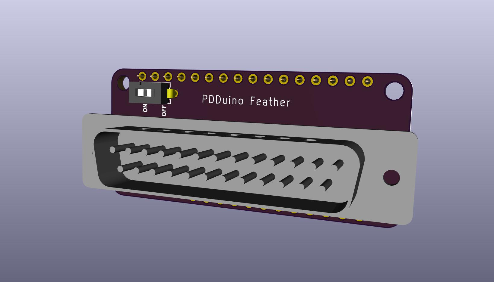
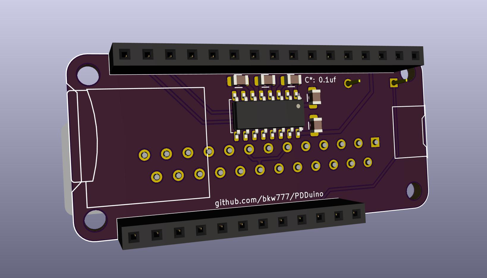

# PDDuino PCBs

## PDDuino_Feather - for Adafruit Feather Adalogger, 32u4 and M0

  

Complete BOM, including Feather 32u4 Adalogger board, 105mah lipo battery, and pin header sockets: <https://www.digikey.com/short/zr44wt> 

You may remove the following items from the cart: 
* Battery - If you use the BCR port or other usb power source, then you don't need the battery. 
* Socket headers - If you want to solder the Adalogger board using the pins it comes with, then you don't need the sockets. 
* Adalogger board - If you already have one, you don't necessarily need more.

The same PDDuino_Feather adapter board works for both the 32u4 and the M0 versions of Adalogger boards.

## PDDuino_Teensy35 - for Teensy 3.5
coming

## PDDuino_Teensy36 - for Teensy 3.6
coming

## PDDuino_Teensy41 - for Teensy 4.1
coming

